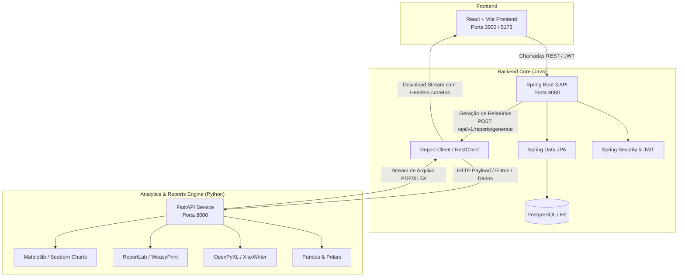

# Arquitetura e Plano de Implementação: Backend Spring Boot & Serviço de Relatórios Python

Este documento descreve a arquitetura técnica, divisão de responsabilidades, estratégia de integração e o plano detalhado de implementação para o backend do **SmartFlow IA (OTIS)**, combinando **Java Spring Boot** (para regras de negócio, dados e segurança) com **Python** (para geração de dashboards, relatórios analíticos, PDFs e planilhas formatadas).

---

## 1. Visão Geral da Arquitetura

O sistema adota uma arquitetura em camadas orientada a serviços:



### Divisão de Responsabilidades

| Componente | Tecnologia | Papel Principal |
| :--- | :--- | :--- |
| **Backend Core** | **Java 17 + Spring Boot 3.3.x** | APIs REST, regras de negócio do SmartFlow, gestão de chamados, técnicos, equipamentos, telemetria, autenticação/autorização (JWT), persistência de dados. |
| **Reports & Analytics Service** | **Python 3.12 + FastAPI** | Processamento analítico, agregação estatística, formatação de planilhas Excel corporativas (.xlsx com estilos Otis), geração de relatórios executivos em PDF com gráficos visuais e exportações de dashboards. |
| **Banco de Dados** | **PostgreSQL (Prod) / H2 (Dev)** | Armazenamento de dados relacionais e transacionais com migrações ou mapeamento JPA. |
| **Frontend** | **React + Vite + TypeScript** | Interface visual que consome as APIs do Spring Boot e efetua download direto dos relatórios. |

---

## 2. Decisões Técnicas e Pontos de Revisão

> **Compatibilidade de Versões do Java & Spring Boot:**
> O ambiente local possui **Java 17 (OpenJDK Temurin-17)** e **Python 3.12.10**. O `pom.xml` atual foi ajustado para **Spring Boot 3.3.4** e **Java 17**, garantindo compilação estável com o Maven Wrapper (`mvnw.cmd`).

> **Padrão de Comunicação Spring Boot ↔ Python:**
> A melhor prática de mercado é utilizar uma API interna leve em **FastAPI** rodando em background (ou via Docker Compose). O Spring Boot valida a sessão do usuário, aplica permissões (RBAC: Presidente, Gerente, Supervisor), extrai ou delega o escopo de dados e chama o microserviço Python via `RestClient`. O arquivo gerado é repassado como stream de resposta HTTP (`Content-Disposition: attachment`).

---

## 3. Estrutura de Pastas do Projeto

```
SmartFlowIA/
├── Backend/
│   ├── smartflow-api/                 # Backend Java Spring Boot
│   │   ├── pom.xml                    # Spring Boot 3.3.4, Java 17, JPA, Web, Security, Lombok
│   │   └── src/
│   │       ├── main/
│   │       │   ├── java/br/com/otis/smartflow/
│   │       │   │   ├── SmartflowApiApplication.java
│   │       │   │   ├── config/        # CorsConfig, DataInitializer
│   │       │   │   ├── controller/    # EquipmentController, ReportsController
│   │       │   │   ├── model/         # Entidades JPA (Equipment, etc.)
│   │       │   │   ├── repository/    # Spring Data JPA Repositories
│   │       │   │   └── service/       # ReportsIntegrationService (RestClient)
│   │       │   └── resources/
│   │       │       └── application.properties # H2, Porta 8080, Swagger
│   │
│   └── smartflow-reports/             # Serviço de Relatórios Python
│       ├── requirements.txt           # fastapi, uvicorn, pandas, openpyxl, reportlab, matplotlib
│       ├── main.py                    # Aplicação FastAPI (Porta 8000)
│       └── generators/
│           ├── executive_pdf.py       # Relatório Executivo Nacional (PDF)
│           ├── sla_excel.py           # Cumprimento de SLA por Polo (Excel)
│           ├── financial_dossier.py   # Dossiê Financeiro & DRE (Excel)
│           └── predictive_inventory.py# Inventário Preditivo & Falhas (Excel)
│
└── FrontEnd/
    └── prototipo/                     # Frontend React + Vite
```

---

## 4. Modelagem de Relatórios & Dashboards Suportados

Baseado nos relatórios definidos no protótipo (`ReportsModule.tsx`), o serviço Python fornece:

1. **Relatório Executivo Nacional (Presidência)**:
   - **Formato:** PDF diagramado em alta resolução.
   - **Conteúdo:** Sumário executivo, disponibilidade global da frota (%), taxa de SLA, gráficos comparativos de custos e métricas preditivas.

2. **Relatório de Cumprimento de SLA por Polo**:
   - **Formato:** Excel estilizado (.xlsx) e CSV.
   - **Conteúdo:** Desempenho por supervisor/região, tempo de deslocamento (TA), tempo de solução (TB), chamados fora do prazo e índice de reincidência.

3. **Dossiê Financeiro & DRE de Contratos**:
   - **Formato:** Excel com abas e fórmulas (.xlsx).
   - **Conteúdo:** Receita por contrato, consumo de peças, horas técnicas aplicadas, margem operacional de cada contrato e alertas de risco financeiro.

4. **Inventário Preditivo & Padrões de Falha**:
   - **Formato:** PDF / Excel.
   - **Conteúdo:** Ranking de equipamentos por score de risco (0-100), componentes sob fadiga (portas AT120, drives regenerativos, cabos) e recomendações da IA.

5. **Auditoria de Decisões (Supervisor vs IA)**:
   - **Formato:** PDF com tabela de evidências.
   - **Conteúdo:** Histórico de desvios operacionais entre a indicação do SmartFlow IA e a alocação manual feita pelo supervisor, com justificativas.

---

## 5. Como Executar

### 1. Iniciar o Serviço de Relatórios Python (Porta 8000)
```powershell
cd Backend/smartflow-reports
uvicorn main:app --port 8000 --reload
```
- Swagger / OpenAPI do Python: `http://localhost:8000/docs`

### 2. Iniciar o Backend Java Spring Boot (Porta 8080)
```powershell
cd Backend/smartflow-api
.\mvnw.cmd spring-boot:run
```
- Swagger UI do Spring Boot: `http://localhost:8080/swagger-ui.html`
- Console H2: `http://localhost:8080/h2-console`

### 3. Iniciar o Frontend React (Porta 3000 / 5173)
```powershell
cd FrontEnd/prototipo
npm run dev
```
